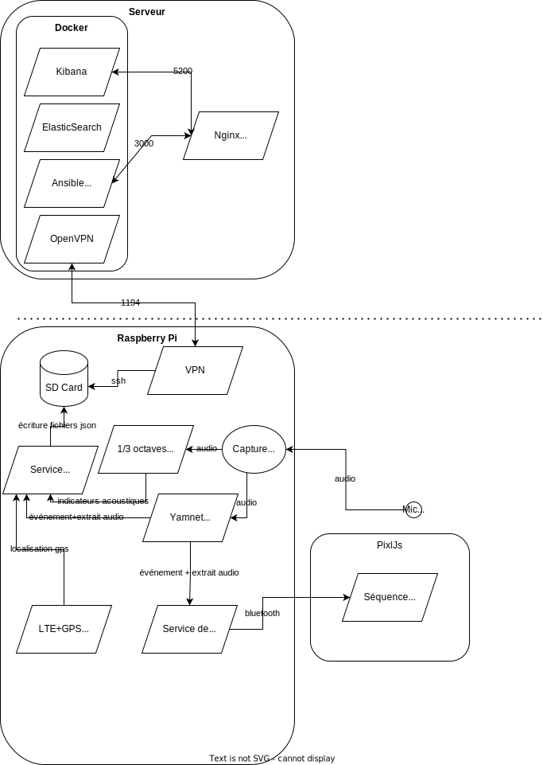
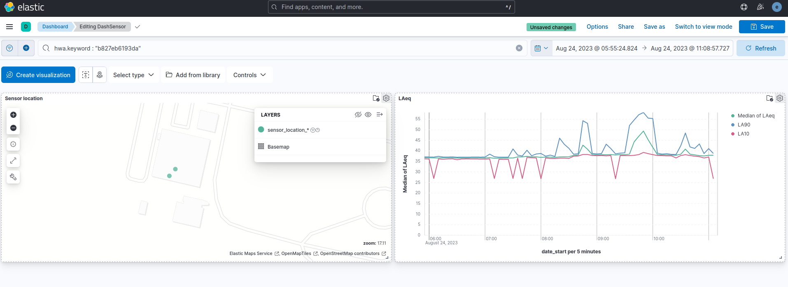

# Web backend/frontend for NoiseSensor with Raspberry-Pi

This server side application is using Docker.

The following containers/service are used:

- OpenVPN : Connect to all RPI on a private secured network
- Ansible Semaphore : Manage all RPI and fetch/process data
- Elastic Stack : Index all data and a web interface generate graph, maps and statistics

*Kibana display sensors location and noise level indicators chart*